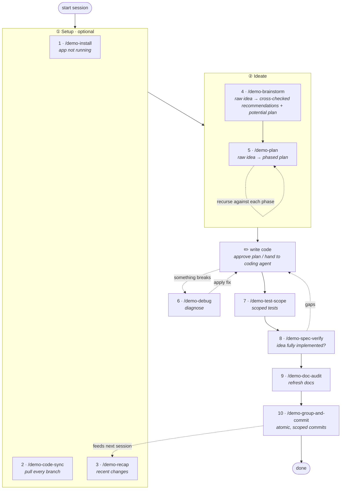

# Skills — Usage Guide

The ten `/demo-*` skills under [`.claude/skills/`](../.claude/skills) cover one
working session end-to-end: **orient → ideate → implement → validate → commit**.
The flow is mostly linear, with one feedback loop (today's commits become
tomorrow's recap input) and one recursion point (`/demo-plan` can re-enter
itself on its own phases).

> Slash commands. Type `/` in Claude Code (after a restart) to see them all.

## The 10 skills, in usage order

| # | Skill | What it does |
| --- | --- | --- |
| 1 | `/demo-install` | Set the project up locally — use when the app isn't already running on this machine. |
| 2 | `/demo-code-sync` | Pull changes across every repo / branch in the workspace. |
| 3 | `/demo-recap` | Summarize what happened in the most recent commits. |
| 4 | `/demo-brainstorm` | Take a raw idea, look at the existing code, cross-check it against industry best practices, contribute its own opinions + recommendations, and draft a potential plan. |
| 5 | `/demo-plan` | Turn a raw idea (or a brainstorm output) into a phased, implementable plan. **Recursive** — re-invoke it against any phase to expand that phase into its own sub-plan. |
| — | *write code* | Not a skill — approve the proposed edits, or hand the plan to a coding agent. |
| 6 | `/demo-debug` | Ask the AI's opinion on what's going wrong when something breaks. |
| 7 | `/demo-test-scope` | Add tests for a given scope. |
| 8 | `/demo-spec-verify` | Check whether everything was implemented per the input idea — typically the output of `/demo-brainstorm` or `/demo-plan`. |
| 9 | `/demo-doc-audit` | Check and update the documentation, scoped to a path or universal. |
| 10 | `/demo-group-and-commit` | Group local changes into atomic commits with clean, scope-aware messages — the input `/demo-recap` reads next session. |

## The whole process

Three non-obvious arrows in the diagram are worth calling out:

- **`/demo-plan` self-loop.** Same skill, smaller scope. Run it again
  against any phase to deepen that phase into its own sub-plan. This
  is the recursion the talk references, at the planning layer.
- **`/demo-debug` round trip.** Debug is a side-loop reached only
  when something breaks — it diagnoses, you apply the fix, you return
  to writing code.
- **`/demo-group-and-commit` → `/demo-recap`** (dotted, across
  sessions). Today's scope-aware commit messages become the input
  the recap reads tomorrow — each session feeds context to the next.

## Common shortcuts

Not every session walks the full flow. Three frequent shortcuts:

| Scenario | Path |
| --- | --- |
| Small bug fix, cause obvious from symptom | `/demo-debug` → fix → `/demo-test-scope` → `/demo-group-and-commit` |
| Docs only | `/demo-doc-audit` → `/demo-group-and-commit` |
| Read-only catch-up | `/demo-code-sync` → `/demo-recap`, then stop |

## Scope reference

| Scope | Skills |
| --- | --- |
| **Workspace** (across repos) | `demo-install`, `demo-code-sync`, `demo-recap` |
| **Feature / module** | `demo-brainstorm`, `demo-plan`, `demo-debug`, `demo-test-scope`, `demo-spec-verify` |
| **Project / area** | `demo-doc-audit` |
| **Pending changes** | `demo-group-and-commit` |
